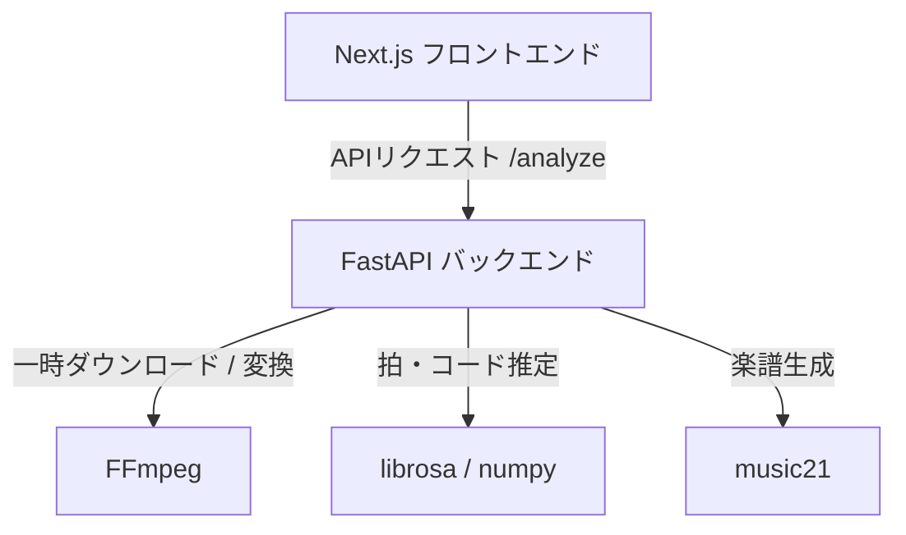

# 運用・動作確認ガイド (Operations & Verification Guide)

本ドキュメントは、ChordPulseアプリケーションをローカル環境で動作させ、機能の検証を行うためのガイドです。本番環境へのデプロイ構成が定まるまでの間、この手順に従ってローカルで動作確認を行ってください。

---

## 1. システム概要と構成

ChordPulseは、以下の2レイヤーで構成されています。



- **フロントエンド**: Next.js (TypeScript) + OpenSheetMusicDisplay (OSMD) による譜面描画
- **バックエンド**: FastAPI (Python 3.12) + `librosa` + `music21` による音声解析・MusicXML生成

---

## 2. 前提環境 (Prerequisites)

ローカルで動作確認を行うには、以下のツールがインストールされ、環境パスが通っている必要があります。

1. **Python 3.12.x**
2. **Node.js 18.x 以上 (LTS推奨)**
3. **FFmpeg** (YouTube URL解析機能を使用する場合に必須)
   - インストール後、ターミナルで `ffmpeg -version` が動作することを確認してください。

---

## 3. バックエンドのセットアップと起動

### 3.1 依存関係のインストール
`backend` ディレクトリで仮想環境（`.venv`）を作成し、ライブラリをインストールします。

```powershell
# backend ディレクトリに移動
cd backend

# 仮想環境の作成
python -m venv .venv

# 仮想環境の有効化 (Windows PowerShell)
.venv\Scripts\Activate.ps1

# 依存関係のインストール (開発・テスト用ライブラリを含む)
python -m pip install --upgrade pip
pip install -e .[dev,youtube]
```

### 3.2 動作確認用環境変数
バックエンドは以下の環境変数によって動作を制御できます。必要に応じて起動前に設定してください。

| 環境変数名 | デフォルト値 | 説明 |
|---|---|---|
| `CHORDPULSE_API_HOST` | `127.0.0.1` | APIのホストアドレス |
| `CHORDPULSE_API_PORT` | `8000` | APIの待ち受けポート |
| `CHORDPULSE_ENABLE_YOUTUBE` | `0` (無効) | YouTube音源の取得許可スイッチ（`1` または `true` で有効化） |
| `CHORDPULSE_MAX_CONCURRENT_ANALYSES` | `2` | 最大同時解析数（CPU枯渇防止用セマフォ上限） |
| `CHORDPULSE_ANALYSIS_TIMEOUT_SECONDS` | `300` | 解析ワーカープロセスの制限時間（秒） |
| `CHORDPULSE_CORS_ORIGINS` | `http://localhost:3000` | 許可するCORSオリジン（カンマ区切り） |

### 3.3 バックエンドの起動
```powershell
# 開発サーバーの起動 (uvicornが呼び出されます)
chordpulse-api
```
起動すると、`http://127.0.0.1:8000` で API 待ち受けが開始されます。

---

## 4. フロントエンドのセットアップと起動

### 4.1 依存関係のインストール
`frontend` ディレクトリに移動し、`npm` でライブラリをインストールします。

```powershell
# frontend ディレクトリに移動
cd ../frontend

# 依存関係のインストール
npm install
```

### 4.2 動作確認用環境変数 (`.env.local`)
ローカル動作確認時には、フロントエンドのルートに `.env.local` ファイルを作成し、以下を設定します。

```env
# バックエンドAPIのエンドポイント
NEXT_PUBLIC_CHORDPULSE_API_URL=http://127.0.0.1:8000
```

### 4.3 フロントエンドの起動
```powershell
# 開発サーバーの起動
npm run dev
```
ブラウザで `http://localhost:3000` を開くことで、UIが表示されます。

---

## 5. ローカル動作確認シナリオ

起動後、以下の順に機能テストを行い、動作が正常であることを確認します。

### シナリオ A: サンプル音源による自動解析 (推奨)
1. 画面上の **「💡 テスト用サンプル音源をセット」** ボタンをクリックします。
2. 同意チェックボックスに自動でチェックが入り、合成されたWAVが自動セットされます。
3. **「解析して譜面を生成」** ボタンを押します。
4. 数秒後に解析が完了し、画面上にC MajorとG Major ofのコード、拍子、テンポ(120 BPM)が反映された譜面が描画されることを確認します。
5. **「MusicXMLをダウンロード」** を押し、正しい `.musicxml` ファイルがダウンロードできることを確認します。

### シナリオ B: ローカルファイルのアップロード解析
1. 自前の MP3 または WAV 音源ファイルをドラッグ＆ドロップするかファイル選択します。
2. 「適法に入手・利用できる音源であり...」のチェックボックスに手動でチェックを入れます。
3. リズムレベル（レベル1〜3）を選択して解析を実行します。
4. それぞれのレベルに応じて、全音符/二分音符（レベル1）、4分音符スラッシュ（レベル2）、Onsetトリガーの8分音符スラッシュ（レベル3）へ譜面表記が切り替わることを確認します。

### シナリオ C: エラー・防御機能の検証
1. **未同意での実行拒否**: チェックボックス의チェックを外し、解析ボタンを押した際に、「適法に利用できる音源であることへの確認が必要です」と赤色バナーで表示され、リクエストが送信されないことを確認します。
2. **容量制限エラー**: 250 MiB を超えるダミーファイルをドロップした際、フロントエンド側およびバックエンドAPI（413 Payload Too Large）の双方でサイズ過大エラーとなることを確認します。
3. **YouTube機能の無効化検証**: バックエンド環境変数 `CHORDPULSE_ENABLE_YOUTUBE=0` の状態でフロントエンドをロードした際、YouTube入力用のタブ自体が非表示または無効化され、利用できないようになっていることを確認します。

---

## 6. トラブルシューティング

- **「FFmpeg is required...」 というエラーが発生する**
  - 原因: YouTube機能のテスト時、実行環境に FFmpeg が見つかりませんでした。
  - 対策: FFmpeg がシステムにインストールされ、環境変数 `PATH` に登録されているか確認してください。
- **「譜面を表示できませんでした...」 と表示されるがダウンロードはできる**
  - 原因: OpenSheetMusicDisplay (OSMD) が壊れたMusicXMLを読み込んだか、パース時に例外が発生しました。
  - 対策: ダウンロードした `.musicxml` をMuseScore等の外部ソフトで開き、フォーマットに破損がないか確認してください。
- **テストコマンドの実行方法**
  - バックエンドの単体テストをローカルで一括実行するには以下を実行します。
    ```powershell
    cd backend
    .venv\Scripts\activate
    python -m pytest tests/ -v
    ```
